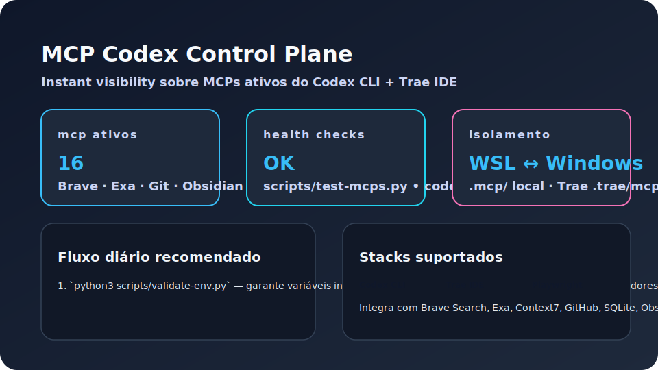

# MCP Codex Playbook

> Guia definitivo para operar servidores Model Context Protocol (MCP) com o Codex CLI em WSL, mantendo isolamento total de IDEs desktop.

[](#)
[](#)
[](docs/reports/SECURITY_FINDINGS.json)
[](#licenca)

## Sumário
- [Visão Geral](#visão-geral)
- [Funcionalidades Principais](#funcionalidades-principais)
- [Requisitos](#requisitos)
- [Instalação e Configuração](#instalação-e-configuração)
- [Guia de Uso](#guia-de-uso)
- [Isolamento Codex x Trae IDE](#isolamento-codex-x-trae-ide)
- [Roadmap](#roadmap)
- [Contribuição](#contribuição)
- [Licença](#licença)
- [Contato](#contato)

## Visão Geral
O MCP Codex Playbook entrega um ambiente de automação previsível para times que operam o Codex CLI dentro do WSL2 Ubuntu 24.04. O repositório reúne scripts, prompts e configuração oficial do `codex-config.toml`, permitindo validar 16 MCPs com um único fluxo e evitando conflitos com MCPs instalados no Trae IDE ou em outras ferramentas desktop.

## Funcionalidades Principais
- **Catálogo oficial de MCPs**: lista curada com Brave Search, Exa, Git, Obsidian, Playwright, Task Manager e outros conectores essenciais.
- **Scripts determinísticos**: instalação (`install_mcps.sh`), preenchimento de `.env` (`setup-apis.py`) e validação (`test-mcps.py`) versionados.
- **Auditoria contínua**: relatórios consolidados em `docs/reports/` com métricas, achados de segurança e snapshot de schema.
- **Isolamento WSL/Windows**: documentação e utilitários dedicados para manter ambientes Codex e Trae independentes.
- **Pronto para CI**: estrutura pensada para rodar em pipelines (lint, audit, smoke tests) com mínima customização.

## Requisitos
- WSL2 Ubuntu 24.04 com acesso a internet.
- Node.js LTS 20.x e npm.
- Python 3.12 com `pip`.
- Codex CLI (`npm i -g @smithery-ai/codex-cli`).
- Chaves válidas para: GitHub, Brave, Exa, Context7, Playwright (opcional), Obsidian (opcional), SQLite (path local).

## Instalação e Configuração
```bash
# 1. Clone o repositório dentro do WSL
git clone https://github.com/zapprosite/mcp-codex.git
cd mcp-codex

# 2. Crie o arquivo .env a partir do template oficial
cp .env.example .env

# 3. Preencha as chaves usando o wizard interativo
python scripts/setup-apis.py

# 4. Instale todos os MCPs no prefixo local `.mcp/`
bash scripts/install_mcps.sh

# 5. Execute a bateria de validação
python3 scripts/test-mcps.py --check-cli
```

### Variáveis importantes
- `FILESYSTEM_BASE_PATH`: restringe o alcance do MCP filesystem.
- `OBSIDIAN_VAULT_PATH`, `MEMORY_DB_PATH`, `SQLITE_DB_PATH`: apontam para dados persistidos em `data/`.
- `PLAYWRIGHT_WS_ENDPOINT`: conecta com instâncias remotas do Playwright.

## Guia de Uso

### Comandos essenciais
```bash
# Listar MCPs configurados no Codex CLI
codex mcp list

# Inspecionar um servidor específico
codex mcp get fetch

# Executar um MCP manualmente (exemplo: obsidian)
npx -y mcp-obsidian $OBSIDIAN_VAULT_PATH

# Atualizar snapshot de auditoria
python scripts/test-mcps.py > docs/reports/SECURITY_FINDINGS.json
```

### Fluxo recomendado
1. **Antes de rodar automações**: `python3 scripts/validate-env.py` para garantir que `.env` está íntegro.
2. **Durante desenvolvimento**: utilize `scripts/start-dual-mcp-daemon.sh` para manter Codex e Trae em sincronia.
3. **Em auditorias**: consulte `docs/SECURITY-AUDIT-2025-11.md` e regenere relatórios conforme necessário.

### Demonstração

> Visão geral de métricas e fluxos recomendados para o ambiente Codex.

## Isolamento Codex x Trae IDE
- Instale MCPs do Trae com `scripts/trae-mcp-setup.ps1`, apontando para `C:\Users\<user>\.trae\mcp`.
- Utilize `node.exe` + `dist/index.js` nas configurações do Trae (nunca `npx`).
- Defina variáveis sensíveis diretamente no Trae, sem reaproveitar o `.env` do WSL.
- Reinicie o painel do Trae após qualquer alteração de `.env` ou `codex-config.toml` para evitar handshakes quebrados.
- Consulte `docs/TRAe-MCP-SETUP.md` para detalhes de caminhos Windows e boas práticas de isolamento.

## Roadmap
- [ ] Automatizar export das métricas de segurança via GitHub Actions.
- [ ] Incluir smoke tests Playwright integrados ao Task Manager MCP.
- [ ] Documentar fluxo de replicação em ambientes de staging.
- [ ] Publicar guia de troubleshooting com casos reais.

## Contribuição
- Leia `CONTRIBUTING.md` para entender o fluxo de branches, validação de segredos e formato de commits.
- Prefira Pull Requests pequenos, com evidências de testes (`python3 scripts/test-mcps.py`).
- Abra issues descrevendo o objetivo, resultado esperado e contexto dos MCPs impactados.
- Utilize labels `security`, `docs`, `mcp/<nome>` para facilitar triagem.

## Licença
Distribuído sob a licença MIT. Consulte o arquivo [`LICENSE`](LICENSE) ou procure a equipe de governança para detalhes de uso corporativo.

## Contato
- **Equipe técnica**: mcp-engineering@trae.app
- **Segurança / Incidentes**: security@trae.app
- **Atualizações e roadmap**: consulte a sala `#mcp-codex` no Slack interno.

---

Mantenedores: Equipe MCP Codex. Feedbacks e sugestões são bem-vindos!
